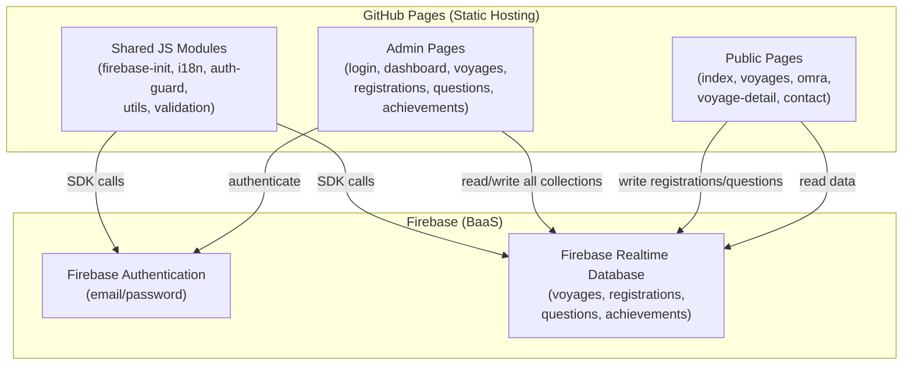
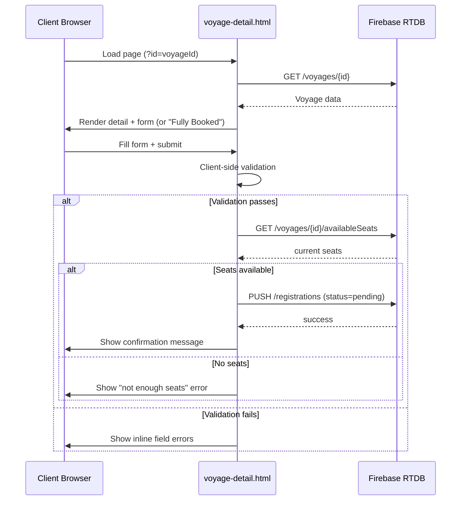
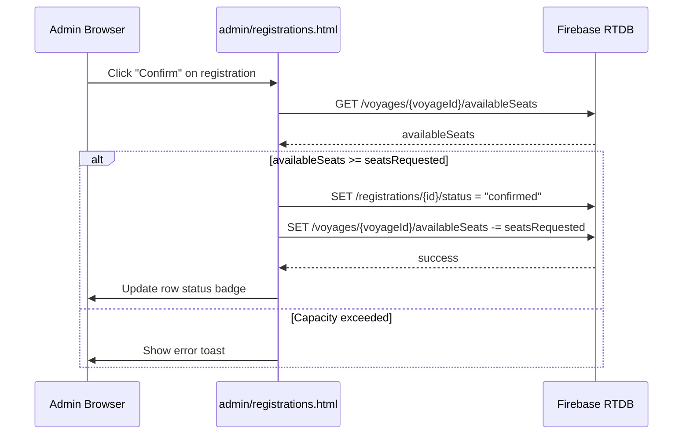
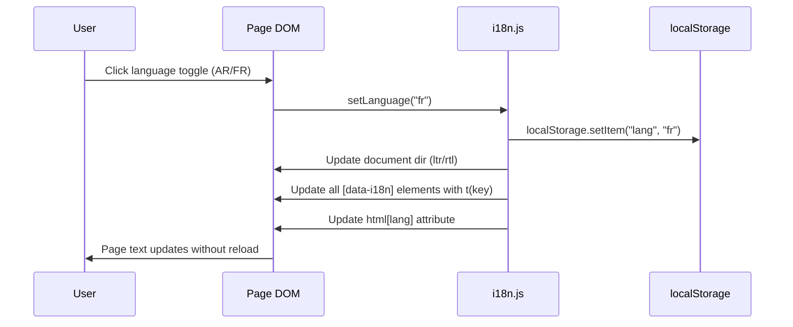

# Design Document

## Dheyafa Tourism Website

---

## Overview

The Dheyafa Tourism website is a fully static web application hosted on GitHub Pages. It serves two audiences:

- **Visitors / Clients** — browse travel packages, register for voyages, and submit questions.
- **Admins** — manage voyages, registrations, questions, and achievements through a protected panel.

All dynamic data is stored in and retrieved from **Firebase Realtime Database (RTDB)**. Admin identity is managed by **Firebase Authentication** (email/password). There is no server-side runtime; every page is a plain HTML file that loads Firebase SDK, Bootstrap 5, and jQuery 3.x from CDN.

The UI is bilingual (Arabic default / French secondary) with RTL/LTR switching, and is designed to be accessible and comfortable for elderly users (large fonts, high contrast, large touch targets).

```
Firebase RTDB endpoint:
  https://dheyafa-e858b-default-rtdb.europe-west1.firebasedatabase.app/
```

---

## Architecture

### High-Level Architecture



### Colour Palette (Redesign)

The redesign shifts to a lighter, airier palette:

| Token | Value | Usage |
|---|---|---|
| `--color-primary` | `#1a6fa8` | Links, active states |
| `--color-primary-dark` | `#145a8a` | Headings, hover states |
| `--color-primary-light` | `#e8f4fd` | Section backgrounds |
| `--color-accent` | `#c07a10` | CTA buttons, highlights |
| `--color-bg` | `#ffffff` | Page background |
| `--color-bg-alt` | `#f4f8fc` | Alternate section background |
| `--navbar-bg` | `#ffffff` | Navbar background (light) |
| `--navbar-border` | `#dce8f5` | Navbar bottom border |

The navbar changes from a dark gradient to a clean white/light background with coloured text and a subtle bottom border, making the logo and brand name stand out clearly.

| Layer | Technology | Delivery |
|---|---|---|
| Markup | HTML5 | Static files |
| Styling | Bootstrap 5.3 + custom CSS | CDN + local |
| Scripting | jQuery 3.7 | CDN |
| Backend SDK | Firebase JS SDK v9 (compat mode) | CDN |
| Database | Firebase Realtime Database | Cloud |
| Auth | Firebase Authentication | Cloud |
| Hosting | GitHub Pages | Static |
| i18n | Custom JS translations object | Local (`js/i18n.js`) |

**Design rationale — Firebase SDK compat mode:** The v9 compat mode (`firebase/compat/*`) exposes the familiar `firebase.database()` API without requiring a build step (Webpack/Rollup), making it compatible with plain `<script>` tags on GitHub Pages.

---

## Components and Interfaces

### Page Inventory

#### Public Pages

| File | Purpose |
|---|---|
| `index.html` | Homepage: hero banner, achievements section, agency info |
| `voyages.html` | List of active voyages |
| `omra.html` | List of active Omra packages |
| `voyage-detail.html` | Detail view + registration form (shared for voyages and Omra) |
| `contact.html` | Question submission form |
| `404.html` | GitHub Pages fallback redirect to homepage |

#### Admin Pages

| File | Purpose |
|---|---|
| `admin/login.html` | Firebase Auth login form |
| `admin/index.html` | Dashboard: unread questions badge, stats summary |
| `admin/voyages.html` | Voyage CRUD management |
| `admin/registrations.html` | View/manage registrations per voyage |
| `admin/questions.html` | View questions grouped by voyage |
| `admin/achievements.html` | Achievement CRUD management |

### Shared JS Modules

| File | Responsibility |
|---|---|
| `js/firebase-init.js` | Firebase app initialisation, exports `db` and `auth` references |
| `js/i18n.js` | Translation strings object (ar/fr), `t(key)` helper, `setLanguage(lang)` |
| `js/auth-guard.js` | Checks Firebase Auth state on every admin page; redirects to login if unauthenticated |
| `js/utils.js` | Shared helpers: date formatting, seat calculation, CSV export, toast notifications |
| `js/validation.js` | Form validation functions: required fields, seat availability, character limits |

### Component Breakdown

#### Header / Navigation (shared partial pattern)

Each HTML page includes an identical `<header>` block containing:
- Agency logo image (`img/logo.png`) + short brand name "Dheyafa Tourism"
- Navigation links (Home, Voyages, Omra, Contact)
- Language toggle button (AR / FR)

Because the site is static (no server-side includes), the header HTML is duplicated across pages. The language toggle calls `setLanguage(lang)` from `i18n.js`, which updates all `[data-i18n]` attributes in the DOM without a page reload.

**Navbar design:** The navbar uses a lighter background (white/very-light-blue) with the logo image on the left, the short brand name "Dheyafa Tourism" next to it, and nav links styled with the primary colour. A subtle bottom border or shadow separates it from the page content.

#### Footer (shared partial pattern)

Each HTML page includes an identical `<footer>` block containing:
- Agency name
- Phone: +216 53 244 968
- Email: ltrabelsi26@gmail.com
- Facebook: https://www.facebook.com/dheyafa.ouedellil

The footer uses a multi-column layout on wider screens and stacks vertically on mobile.

#### Voyage Card Component (voyages.html, omra.html)

Rendered by jQuery from RTDB data. Each card displays:
- Destination / package name
- Departure date, return date (or duration for Omra)
- Price
- Available seats (or "Fully Booked" badge)
- "View Details" button → `voyage-detail.html?id={voyageId}`

#### Registration Form (voyage-detail.html)

Fields: Full Name, Phone, Email, Passport Number, Seats Requested.
Client-side validation runs on submit. On success, writes to `/registrations/{pushId}` and shows a confirmation toast.

#### Contact Form (contact.html)

Fields: Sender Name, Phone, Message (max 1000 chars with live counter), optional Voyage selector.
On success, writes to `/questions/{pushId}` and shows confirmation.

#### Admin Voyage Form (admin/voyages.html)

Modal form for create/edit. Fields: Destination, Type (voyage|omra), Departure Date, Return Date, Duration Days, Price, Capacity, Description, Itinerary, Included Services.
On save, writes/updates `/voyages/{id}`.

#### Admin Registration Table (admin/registrations.html)

Filterable by voyage. Columns: Name, Phone, Email, Passport, Seats, Status, Created At, Actions.
Status change buttons call `updateRegistrationStatus(id, newStatus)` which also recalculates available seats.

---

## Data Models

### Firebase RTDB Schema

```
/voyages/{id}
  destination:       string        — e.g. "Istanbul, Turquie"
  type:              "voyage" | "omra"
  departureDate:     string        — ISO 8601 date "YYYY-MM-DD"
  returnDate:        string        — ISO 8601 date "YYYY-MM-DD"
  durationDays:      number        — computed or manually set
  price:             number        — in TND
  capacity:          number        — max confirmed seats
  availableSeats:    number        — capacity minus sum of confirmed registration seats
  description:       string
  itinerary:         string
  includedServices:  string
  status:            "active" | "archived"
  createdAt:         number        — Unix timestamp (ms)

/registrations/{id}
  voyageId:          string        — ref to /voyages/{id}
  voyageName:        string        — denormalised for display
  fullName:          string
  email:             string
  phone:             string
  passportNumber:    string
  seatsRequested:    number        — ≥ 1
  status:            "pending" | "confirmed" | "cancelled"
  createdAt:         number        — Unix timestamp (ms)

/questions/{id}
  senderName:        string
  phone:             string
  message:           string        — max 1000 chars
  voyageId:          string | null — optional
  voyageName:        string | null — optional, denormalised
  isRead:            boolean
  createdAt:         number        — Unix timestamp (ms)

/achievements/{id}
  title:             string
  description:       string
  date:              string        — ISO 8601 date "YYYY-MM-DD"
  imageUrl:          string | null — optional
  createdAt:         number        — Unix timestamp (ms)
```

### Available Seats Calculation

`availableSeats` is stored as a field on the voyage record and is updated transactionally whenever a registration status changes:

```
availableSeats = capacity − Σ(seatsRequested for all confirmed registrations of this voyage)
```

When an Admin confirms a registration, the system:
1. Reads current `availableSeats` for the voyage.
2. Checks `availableSeats >= registration.seatsRequested`.
3. If yes: updates `registration.status = "confirmed"` and decrements `availableSeats`.
4. If no: shows an error — capacity would be exceeded.

When an Admin cancels a confirmed registration:
1. Updates `registration.status = "cancelled"`.
2. Increments `availableSeats` by `registration.seatsRequested`.

### Data Flow Diagrams

#### Client Registration Flow



#### Admin Registration Status Change Flow



#### Language Toggle Flow



---

## i18n Approach

### Translation Object Structure (`js/i18n.js`)

```javascript
const translations = {
  ar: {
    nav_home: "الرئيسية",
    nav_voyages: "الرحلات",
    nav_omra: "عمرة",
    nav_contact: "اتصل بنا",
    btn_register: "سجّل الآن",
    btn_fully_booked: "محجوز بالكامل",
    form_full_name: "الاسم الكامل",
    // ... all keys
  },
  fr: {
    nav_home: "Accueil",
    nav_voyages: "Voyages",
    nav_omra: "Omra",
    nav_contact: "Contact",
    btn_register: "S'inscrire",
    btn_fully_booked: "Complet",
    form_full_name: "Nom complet",
    // ... all keys
  }
};

function t(key) {
  const lang = localStorage.getItem("lang") || "ar";
  return translations[lang][key] || key;
}

function setLanguage(lang) {
  localStorage.setItem("lang", lang);
  document.documentElement.lang = lang;
  document.documentElement.dir = lang === "ar" ? "rtl" : "ltr";
  document.querySelectorAll("[data-i18n]").forEach(el => {
    const key = el.getAttribute("data-i18n");
    el.textContent = t(key);
  });
  document.querySelectorAll("[data-i18n-placeholder]").forEach(el => {
    el.placeholder = t(el.getAttribute("data-i18n-placeholder"));
  });
}
```

### HTML Usage Pattern

```html
<button data-i18n="btn_register">سجّل الآن</button>
<input data-i18n-placeholder="form_full_name" placeholder="الاسم الكامل">
```

### Language Initialisation

On every page load, `i18n.js` reads `localStorage.getItem("lang")` (defaulting to `"ar"`) and calls `setLanguage(lang)` immediately, ensuring the correct language and direction are applied before the user sees content.

---

## Admin Auth Flow

### Authentication Architecture

```mermaid
flowchart TD
    A[Admin navigates to admin/* page] --> B{auth-guard.js runs}
    B --> C{Firebase Auth state?}
    C -->|Authenticated| D[Page loads normally]
    C -->|Not authenticated| E[Redirect to admin/login.html]
    E --> F[Admin enters email + password]
    F --> G[firebase.auth().signInWithEmailAndPassword]
    G -->|Success| H[Redirect to admin/index.html]
    G -->|Failure| I[Show error message]
    D --> J{Inactivity timer}
    J -->|60 min elapsed| K[firebase.auth().signOut]
    K --> E
```

### Auth Guard Implementation (`js/auth-guard.js`)

```javascript
firebase.auth().onAuthStateChanged(user => {
  if (!user) {
    window.location.href = "/admin/login.html";
  }
});
```

This script is included as the **first** `<script>` tag on every admin page (after firebase-init.js). The page content is hidden by default (`<body style="display:none">`) and revealed only after the auth check passes.

### Session Persistence

Firebase Auth persistence is set to `SESSION` (tab-scoped, cleared on tab close):

```javascript
firebase.auth().setPersistence(firebase.auth.Auth.Persistence.SESSION)
```

### Inactivity Timer

A 60-minute inactivity timer resets on `mousemove`, `keydown`, and `touchstart` events. On expiry, `firebase.auth().signOut()` is called and the user is redirected to the login page.

```javascript
let inactivityTimer;
function resetTimer() {
  clearTimeout(inactivityTimer);
  inactivityTimer = setTimeout(() => {
    firebase.auth().signOut().then(() => {
      window.location.href = "/admin/login.html";
    });
  }, 60 * 60 * 1000); // 60 minutes
}
["mousemove", "keydown", "touchstart"].forEach(evt =>
  document.addEventListener(evt, resetTimer)
);
resetTimer();
```

---

## Key JS Modules

### `js/firebase-init.js`

Initialises the Firebase app with the project config and exports `db` (database reference) and `auth` (auth instance). Must be loaded before all other scripts.

```javascript
const firebaseConfig = {
  apiKey: "...",
  authDomain: "dheyafa-e858b.firebaseapp.com",
  databaseURL: "https://dheyafa-e858b-default-rtdb.europe-west1.firebasedatabase.app/",
  projectId: "dheyafa-e858b",
  storageBucket: "dheyafa-e858b.appspot.com",
  messagingSenderId: "...",
  appId: "..."
};
firebase.initializeApp(firebaseConfig);
const db = firebase.database();
const auth = firebase.auth();
```

### `js/utils.js`

Key functions:

| Function | Description |
|---|---|
| `formatDate(isoString, lang)` | Formats ISO date to locale-appropriate string |
| `calculateAvailableSeats(voyage, registrations)` | Pure function: `capacity − Σ confirmed seats` |
| `showToast(message, type)` | Displays Bootstrap toast notification |
| `exportToCSV(rows, filename)` | Generates UTF-8 BOM CSV and triggers download |
| `generateId()` | Returns a Firebase push-style unique ID (client-side) |

### `js/validation.js`

Key functions:

| Function | Description |
|---|---|
| `validateRegistrationForm(formData)` | Returns `{valid: bool, errors: {field: message}}` |
| `validateContactForm(formData)` | Returns `{valid: bool, errors: {field: message}}` |
| `validateVoyageForm(formData)` | Returns `{valid: bool, errors: {field: message}}` |
| `isValidEmail(email)` | Returns boolean |
| `isValidPhone(phone)` | Returns boolean (Tunisian format) |
| `isWhitespaceOnly(str)` | Returns boolean |

### `js/i18n.js`

Described in the i18n section above. Exports `t(key)` and `setLanguage(lang)`.

### `js/auth-guard.js`

Described in the Admin Auth Flow section above.

---

## Error Handling

### Firebase RTDB Unreachable

All RTDB reads use `.catch()` handlers that display a user-friendly error message (translated via i18n) instructing the visitor to try again later. The error message is rendered in a Bootstrap alert component adjacent to the relevant content area.

### Form Validation Errors

Inline validation errors are displayed below each invalid field using Bootstrap's `.invalid-feedback` pattern. The submit button is re-enabled after the user corrects the errors.

### Seat Availability Race Condition

When a client submits a registration, the system reads `availableSeats` immediately before writing. If the value has changed between page load and submission (another registration was confirmed), the write is rejected and the client sees an updated "X seats available" message.

For admin status changes, a Firebase transaction is used to atomically read and update `availableSeats`, preventing double-confirmation of seats.

### Auth Errors

Firebase Auth error codes are mapped to user-friendly messages in both Arabic and French:

| Firebase Error Code | Displayed Message |
|---|---|
| `auth/wrong-password` | "Mot de passe incorrect" / "كلمة المرور غير صحيحة" |
| `auth/user-not-found` | "Compte introuvable" / "الحساب غير موجود" |
| `auth/too-many-requests` | "Trop de tentatives" / "محاولات كثيرة جداً" |

### 404 Fallback

`404.html` contains a meta-refresh redirect to `index.html` and a manual link, satisfying GitHub Pages' requirement for a fallback page.

---

## Testing Strategy

### Dual Testing Approach

The testing strategy combines **unit/example-based tests** for specific scenarios and **property-based tests** for universal correctness guarantees.

### Unit Tests

Unit tests cover:
- Form validation functions (`validateRegistrationForm`, `validateContactForm`, `validateVoyageForm`)
- Utility functions (`calculateAvailableSeats`, `formatDate`, `isWhitespaceOnly`, `isValidEmail`)
- i18n functions (`t(key)`, `setLanguage`)
- Auth guard redirect logic (mocked Firebase Auth)

### Property-Based Tests

Property-based testing is applicable to this feature because:
- The seat calculation logic is a pure function with a large input space
- Form validation has universal rules (e.g., whitespace-only inputs are always invalid)
- i18n round-trip behaviour should hold for all translation keys
- Registration status transitions have invariants that must hold across all voyages and registrations

**PBT Library:** [fast-check](https://github.com/dubzzz/fast-check) (JavaScript, no build step required for Node.js test runner)

**Configuration:** Minimum 100 iterations per property test.

**Tag format:** `// Feature: dheyafa-tourism-website, Property {N}: {property_text}`

### Integration Tests

Integration tests (manual or with Firebase Emulator) cover:
- End-to-end registration write to RTDB
- Admin login and auth guard redirect
- Voyage CRUD operations
- Question read/mark-as-read flow

### Accessibility Testing

- Automated: axe-core browser extension scan on all public pages
- Manual: keyboard navigation, screen reader (NVDA/VoiceOver) spot-check
- Note: Full WCAG 2.1 AA validation requires manual testing with assistive technologies

---

## Correctness Properties

*A property is a characteristic or behavior that should hold true across all valid executions of a system — essentially, a formal statement about what the system should do. Properties serve as the bridge between human-readable specifications and machine-verifiable correctness guarantees.*

Property-based testing is applicable to this feature because the core business logic — seat calculation, form validation, data record construction, sorting, filtering, grouping, and i18n — consists of pure functions with large input spaces where input variation reveals edge cases that example-based tests would miss.

**PBT Library:** [fast-check](https://github.com/dubzzz/fast-check)
**Minimum iterations:** 100 per property test
**Tag format:** `// Feature: dheyafa-tourism-website, Property N: <property_text>`

---

### Property 1: Voyage card rendering contains all required fields

*For any* active voyage object (of type `voyage` or `omra`), the HTML rendered by the voyage card function should contain the destination (or package name), departure date, price, and available seats count.

**Validates: Requirements 2.1, 2.2**

---

### Property 2: Voyage detail view contains all required fields

*For any* voyage object, the HTML rendered by the voyage detail view function should contain the description, itinerary, included services, and a register button element.

**Validates: Requirements 2.3**

---

### Property 3: Fully booked indicator when available seats reach zero

*For any* voyage object where `availableSeats <= 0`, the rendered card and detail view should display a "fully booked" indicator and the register button should be absent or disabled.

**Validates: Requirements 2.4**

---

### Property 4: Voyage list sorted by departure date

*For any* array of voyage objects with varying departure dates, after applying the default sort, each voyage's `departureDate` should be less than or equal to the next voyage's `departureDate` (non-decreasing order).

**Validates: Requirements 2.6**

---

### Property 5: Registration record construction preserves all form fields with pending status

*For any* valid registration form data object (containing fullName, email, phone, passportNumber, seatsRequested, voyageId, voyageName), the constructed registration record should contain all those fields with matching values, and its `status` field should equal `"pending"`.

**Validates: Requirements 3.1, 3.5**

---

### Property 6: Form validation rejects submissions with missing required fields

*For any* form data object (registration, contact, or voyage) where at least one required field is absent or whitespace-only, the corresponding validation function should return `valid: false` and include an error entry for each missing field.

**Validates: Requirements 3.2, 4.2, 6.4**

---

### Property 7: Seat availability guard rejects over-capacity requests

*For any* voyage with a given `availableSeats` value and any registration where `seatsRequested > availableSeats`, the seat availability check should return an error and the registration should not be created.

**Validates: Requirements 3.3, 7.4**

---

### Property 8: Question record construction preserves all form fields

*For any* valid contact form data object (containing senderName, phone, message, and optionally voyageId/voyageName), the constructed question record should contain all provided fields with matching values, and `isRead` should be `false`.

**Validates: Requirements 4.1**

---

### Property 9: Message length validation enforces 1000-character limit

*For any* string with `length > 1000`, `validateContactForm` should return `valid: false` with an error on the `message` field. *For any* string with `length <= 1000`, no length-related error should be returned for the `message` field.

**Validates: Requirements 4.4**

---

### Property 10: Voyage record construction sets required fields and active status

*For any* valid voyage form data object (containing destination, departureDate, returnDate, price, capacity, description, itinerary, includedServices, and type), the constructed voyage record should contain all those fields with matching values, and its `status` field should equal `"active"`.

**Validates: Requirements 6.1**

---

### Property 11: Archiving a voyage removes it from the active listing

*For any* voyage, after the archive operation sets its `status` to `"archived"`, filtering the voyage collection by `status === "active"` should not include that voyage.

**Validates: Requirements 6.3**

---

### Property 12: Registration filter returns only registrations for the selected voyage

*For any* array of registration objects and any `voyageId`, filtering registrations by that `voyageId` should return only registrations where `registration.voyageId === voyageId`, and no registrations with a different `voyageId` should appear in the result.

**Validates: Requirements 7.1**

---

### Property 13: Confirming then cancelling a registration restores available seats

*For any* voyage with `availableSeats >= seatsRequested`, after confirming a registration (decrementing `availableSeats` by `seatsRequested`) and then cancelling it (incrementing `availableSeats` by `seatsRequested`), the `availableSeats` value should equal its original value.

**Validates: Requirements 7.2, 7.3**

---

### Property 14: CSV export contains all registration fields and UTF-8 BOM

*For any* non-empty array of registration objects, the string produced by `exportToCSV` should start with the UTF-8 BOM (`\uFEFF`) and should contain each registration's fullName, email, phone, passportNumber, seatsRequested, status, and createdAt values.

**Validates: Requirements 7.5**

---

### Property 15: Question grouping places each question in the correct group

*For any* array of question objects, the `groupByVoyage` function should place each question with a non-null `voyageId` into the group keyed by that `voyageId`, and each question with a null/undefined `voyageId` into the `"general"` group. No question should appear in more than one group.

**Validates: Requirements 8.1**

---

### Property 16: Marking a question as read decrements the unread count by exactly one

*For any* collection of questions containing at least one unread question (`isRead: false`), after marking one unread question as read, the count of questions where `isRead === false` should decrease by exactly 1.

**Validates: Requirements 8.3, 8.4**

---

### Property 17: Achievement record construction preserves all provided fields

*For any* valid achievement form data object (containing title, description, date, and optionally imageUrl), the constructed achievement record should contain all provided fields with matching values.

**Validates: Requirements 1.2, 9.1**

---

### Property 18: Language toggle updates all translated elements

*For any* translation key present in both the `ar` and `fr` translation objects, after calling `setLanguage("fr")`, `t(key)` should return the French translation string; after calling `setLanguage("ar")`, `t(key)` should return the Arabic translation string. The two return values should be different strings (no key maps to the same text in both languages).

**Validates: Requirements 10.6**

